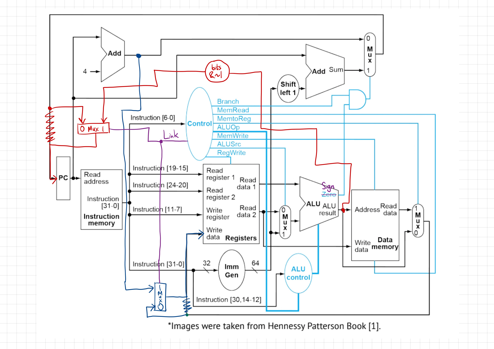

# EC ENGR M116C Computer Assignment 1: Report

## Datapath Design

As evident from the diagram, my design largely builds on the architecture we went over in class. The R-type instructions (ADD, SUB, XOR, SRA), I-type instructions (ADDI, ANDI), LW, and SW can already be implemented with the datapath design and control signals present.

To implement BLT and JALR, I made some additions (colored in red, dark blue, and purple).

**RED:**

In order to support the jump behavior of JALR, I extended the ALU output line to feed back into the PC. Specifically:

* It feeds into a new Mux such that we can control whether the PC is updated with the ALU output or with the value from before (the output from the PC+4 vs. PC+offset Mux).
* The red wire only takes `bits[31:1]` and sets the LSB to 0 as consistent with the RISC-V ISA reference, which describes the jumping part of the JALR pseudocode as `pc <= {(reg[rs1] + offset)[31:1], 1’b0}`. This is to make sure we're always using an even address.

**DARK BLUE:**

In order to support the register-setting behavior of JALR, I extended the output line from PC+4 to feed into the "Write data" port of the register file.

Specifically, it feeds into a new Mux such that we can control whether "Write data" receives this PC+4 value or the normal writeback value from before.

**PURPLE:**

To control the Muxes introduced in the **RED** and **DARK BLUE** changes, I introduced a *new* control signal called **Link**. When the instruction is JALR, Link=1, causing the red Mux to select the ALU output as the value to write to the PC and causing the blue Mux to select the value of PC+4 to write to the destination register.

Finally, to implement BLT, it was just a matter of changing the **Zero** flag on the ALU to a **Sign** flag, where the Sign flag is set when the ALU output is negative (MSB=1). The idea largely resembles that of BEQ in that I reframe `rs1 < rs2` as checking `rs1 - rs2 < 0`. This way, all the control signals of BEQ, including ALUOp=SUB, can be reused for BLT.

## Control Signal Reference

| Instruction | Opcode  | RegWrite | AluSrc | Branch | MemRead | MemWrite | MemtoReg | Link | ALUOp |
| ----------- | ------- | -------- | ------ | ------ | ------- | -------- | -------- | ---- | ----- |
| R-type      | 0110011 | 1        | 0      | 0      | 0       | 0        | 0        | 0    | FUNC  |
| I-type      | 0010011 | 1        | 1      | 0      | 0       | 0        | 0        | 0    | FUNC  |
| LW          | 0000011 | 1        | 1      | 0      | 1       | 0        | 1        | 0    | ADD   |
| SW          | 0100011 | 0        | 1      | 0      | 0       | 1        | 0        | 0    | ADD   |
| BLT         | 1100011 | 0        | 0      | 1      | 0       | 0        | 0        | 0    | SUB   |
| JALR        | 1100111 | 1        | 1      | 0      | 0       | 0        | 0        | 1    | ADD   |

My control signals are largely similar to how we defined them in class. The notable differences are that:

* Instead of BEQ, we have BLT. However, consistent with the RISC-V ISA reference, I did not change any of its control signals. Instead, I simply made use of a new **Sign** flag on the ALU instead of the **Zero** flag, as described [above](#datapath-design).
* I have a new group for the JALR instruction, which also introduces a new control signal **Link** exclusive to it (1 for JALR, 0 for all other instruction groups in this architecture). JALR needs to write to registers and make use of an immediate operand, so it sets the **RegWrite** and **AluSrc** control signals in addition. It also makes use of addition to compute the address to jump to, so we set **ALUOp** to **ADD**.

## Answers to Questions

> **What is the total number of cycles for running "all" trace (ZERO instruction included)?**

Since we're assuming a single-cycle processor design, the number of cycles to run the trace is simply equal to the number of assembly instructions provided in `23all.s`, which is 14. Adding one for the ZERO instruction (the program termination condition) gives us **15 total cycles**.

> **How many r-type instructions does this program ("all") have?**

The R-type instructions that we implemented are ADD, SUB, XOR, and SRA. `23all.s` includes 1 SUB instruction and 1 ADD instruction, so the "all" program has a total of **2 R-type instructions**.

> **What is the IPC of this processor (for "all" trace)?**

Since we're assuming a single-cycle processor design, the instructions per cycle (IPC) is equal to **1** by definition.
